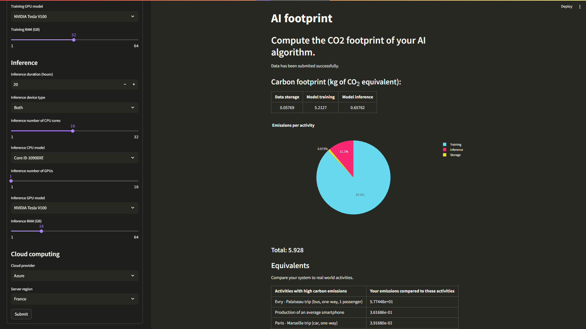

# AI-footprint
A small app that computes the CO2 emissions of your AI algorithm.


## Set up
This application uses [Streamlit](https://streamlit.io). Make sure you have it installed on your computer or run the following command (more info [here](https://docs.streamlit.io/get-started/installation)):
```bash
pip install streamlit
```
To download and run AI-footprint, run:
```bash
git clone https://github.com/brayevalerien/AI-footprint.git
cd AI-footprint
streamlit run ./src/aifootprint.py
```
It will start the local server, that you can access by following the link provided by Streamlit. Note that once the application has been download, only the last command is necessary.

## Usage
To get an estimation of the CO2 emissions of your model, fill out the form in the side bar and click on the "Submit" button. If your device model or server region is not available, choose the closest option to get the best estimation possible.

## References
The method used to compute CO2 emissions is based on the following the works:
- AI Index Report 2023 ; Artificial Intelligence Index — aiindex.stanford.edu. https://aiindex.stanford.edu/report/.
- Green Algorithms — calculator.green-algorithms.org. https://calculator.green-algorithms.org
- Joséphine Boone. L’IA pointée du doigt pour son coût environnemental astronomique — lesechos.fr. https://www.lesechos.fr/tech-medias/
intelligence-artificielle/lia-pointee-du-doigt-pour-son-cout-environnemental-astronomique-1913779, 03 2023.
- France Direction Générale des entreprises (2014-. . . . ). Intelligence artificielle, état de l’art et perspectives pour la France : rapport final. 2019.
- Jesse Dodge, Taylor Prewitt, Remi Tachet Des Combes, Erika Odmark, Roy Schwartz, Emma Strubell, Alexandra Sasha Luccioni, Noah A. Smith, Nicole DeCario, and Will
Buchanan. Measuring the carbon intensity of ai in cloud instances, 2022
- Ralf Gitzel. Estimating the sustainability of ai models based on theoretical models and experimental data, 04 2023.
- INSEE. Définition - Intensité en carbone. https://www.insee.fr/fr/metadonnees/definition/c1269, 2020.
- Luiz Carlos De Jesus Junior. How to calculate the carbon footprint of training/running a large AI model in the cloud.
https://blog.revolve.team/2023/06/27/ai-carbon-footprint/
- Anne-Laure Ligozat, Julien Lefevre, Aurélie Bugeau, and Jacques Combaz. Unraveling the hidden environmental impacts of ai solutions for environment life cycle
assessment of ai solutions. Sustainability, 14(9) :5172, April 2022.
- David Patterson, Joseph Gonzalez, Urs Hölzle, Quoc Le, Chen Liang, Lluis-Miquel Munguia, Daniel Rothchild, David R. So, Maud Texier, and Jeff Dean. The carbon
footprint of machine learning training will plateau, then shrink. Computer, 55(7) :18–28, 2022.
- Rajkumar P.V. Gauging carbon footprint of ai/ml implementations in smart cities : Methods and challenges, 2022.
- Anshul Roy. Introduction to CRISP DM Framework for Data Science and Machine Learning.
https://www.linkedin.com/pulse/chapter-1-introduction-crisp-dm-framework-data-science-anshul-roy/, juin 2018.
- Emma Strubell, Ananya Ganesh, and Andrew McCallum. Energy and policy considerations for deep learning in NLP. CoRR, abs/1906.02243, 2019.